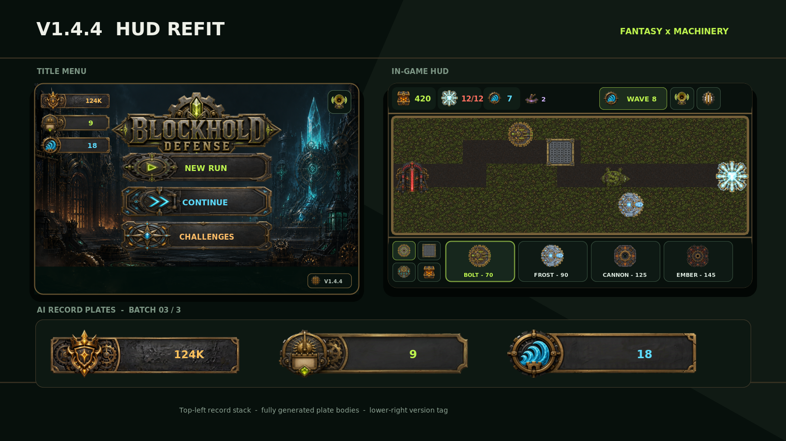

# v1.4.4 HUD refit

v1.4.4 rebuilds the Canvas interface around a compact, sprite-first fantasy-machinery system. Simulation, saves, balance, and touch targets are unchanged; the release changes information hierarchy, chrome, and artwork.



> The image above is a source-generated layout reference, not an emulator screenshot. Run `tools/generate_hud_preview_v144.sh` to rebuild it from the packaged assets.

## Interface changes

- **Title:** a generated 16:9 fortress-forge scene replaces the procedural grid; one generated logo sprite replaces live `BLOCKHOLD DEFENSE` typography. New Run, Continue, and Challenges now use three full generated button plates in a centered vertical stack.
- **Records:** Best, Daily, and Wave now use complete generated plate sprites stacked vertically in the top-left. The version number moves out of that corner into a compact bottom-right tag.
- **Challenge menu:** the new scene continues behind the challenge view, the Daily choice uses its generated emblem, and compact icon cards avoid repeated seed instructions and modifier descriptions.
- **Top dock:** Blocks, Core, Wave, and secondary resources are icon/value chips. Reforge, wave, sound, and pause are now sprite controls. The old brand/phase sentence and TXT toggle are gone.
- **Bottom dock:** category controls are icon tabs; defense cards retain only identity and cost. Selection panels focus on rank, damage/range, cost, and actions instead of repeating full descriptions.
- **Forgeworks:** resource chips, art-led tabs/cards, and icon pagination replace text-heavy navigation.
- **Drafts and overlays:** perk categories, evolution choices, pause, restart, and menu actions now carry matching sprites.
- **Feedback:** only short timed notices render over the board. Persistent tutorial/status paragraphs were removed; the next-wave countdown remains on the Wave button.
- **Space:** the top dock drops from 14.5% to 12.2% of view height and the bottom dock from 23.5% to 21.5%, increasing the fixed board viewport.

## AI sprite batch 01

Exactly ten generated concepts were used in this turn, per the production limit:

| Runtime drawable | Purpose | Accent |
| --- | --- | --- |
| `hud_play.png` | new run, wave, resume, retry | lime rune |
| `hud_continue.png` | continue and next page | cyan rune |
| `hud_challenge.png` | seeded challenge and wave identity | cyan crystal |
| `hud_sound_on.png` | audio enabled | lime sound arcs |
| `hud_sound_off.png` | audio disabled | ember slash |
| `hud_pause.png` | pause | amber rune |
| `hud_reforge.png` | path reforge and Forge Charge | violet rune |
| `hud_confirm.png` | selected/confirm/upgrade | lime rune |
| `hud_back.png` | back/cancel/previous | pale rune |
| `hud_menu.png` | title mark, Forgeworks, main menu | amber rune |

Batch 01's high-resolution generation outputs are retained in `artwork/ui-production/v1.4.4/source/`. The reviewed runtime controls are 128×128 RGBA PNGs with transparent padding in `app/src/main/res/drawable-nodpi/`.

## AI menu-art batch 02

This follow-up uses **eight** generated concepts, remaining within the ten-sprite turn limit:

| Runtime drawable | Purpose | Runtime size |
| --- | --- | --- |
| `title_background.png` | full-bleed fortress-forge title/challenge scene | 1280×720 |
| `title_logo.png` | unified title mark; replaces live title text | 640×288 |
| `title_button_new_run.png` | full New Run action plate | 640×208 |
| `title_button_continue.png` | full Continue action plate | 640×208 |
| `title_button_challenges.png` | full Challenges action plate | 640×208 |
| `menu_badge_best.png` | best-score/result emblem | 128×128 |
| `menu_badge_wave.png` | wave record and HUD emblem | 128×128 |
| `menu_badge_daily.png` | daily record/challenge emblem | 128×128 |

The three action plates are aligned vertically and share one centerline. The standalone record emblems remain active in challenge cards, the top HUD, and result cards.

## AI record-plate batch 03

The third pass adds three complete sprite bodies; the title no longer wraps standalone glyphs in painted rectangles:

| Runtime drawable | Purpose | Runtime size |
| --- | --- | --- |
| `menu_record_best_plate.png` | best-score plate | 512×160 |
| `menu_record_daily_plate.png` | best daily-wave plate | 512×160 |
| `menu_record_wave_plate.png` | best endless-wave plate | 512×160 |

The approved sources have clean empty metal value fields. Three base generations and three cleanup refinements were used—six image outputs this session, within the limit of ten—and only the three approved clean sources are retained. The plates render Best, Daily, and Wave in that order from top to bottom at the upper-left; the version tag now sits at the lower-right.

## Reproduction

```bash
# Requires ImageMagick 6+
./tools/process_hud_sprites_v144.sh
./tools/generate_hud_preview_v144.sh
```

The processor removes generated neutral backdrops with edge-connected flood fill, normalizes transparent sprites to fixed canvases, scales the title scene to 1280×720, strips volatile metadata for deterministic output, and publishes the Android copies.

## Verification checklist

- Android version: `1.4.4` (`18`)
- Approved runtime art: **10 in Batch 01 + 8 in Batch 02 + 3 in Batch 03 = 21 assets**
- Batch 03 generation/refinement outputs this session: **6**, within the ten-image limit
- New packaged Batch 03 assets: **3**
- All twenty transparent v1.4.4 sprites have transparent corner pixels; the opaque scene and all fixed-size assets match their documented dimensions
- `SpriteCatalog`: all twenty-one v1.4.4 runtime names loaded eagerly
- Preview: 1600×900 PNG regenerated from packaged art and updated for Batch 03
- Static Kotlin pitfall lint: zero errors
- Gradle compile: delegated to the repository's `Build APK` workflow; local Gradle 8.9 acquisition is blocked by the runner's TLS connection
